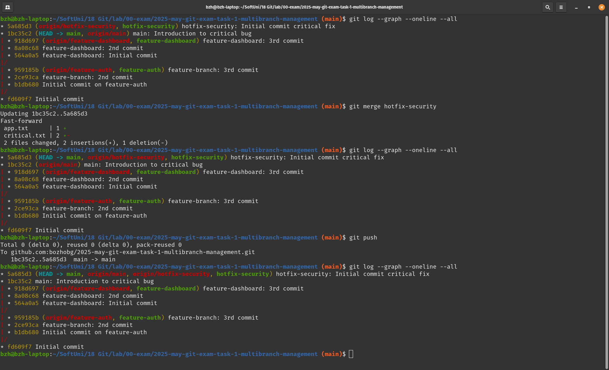
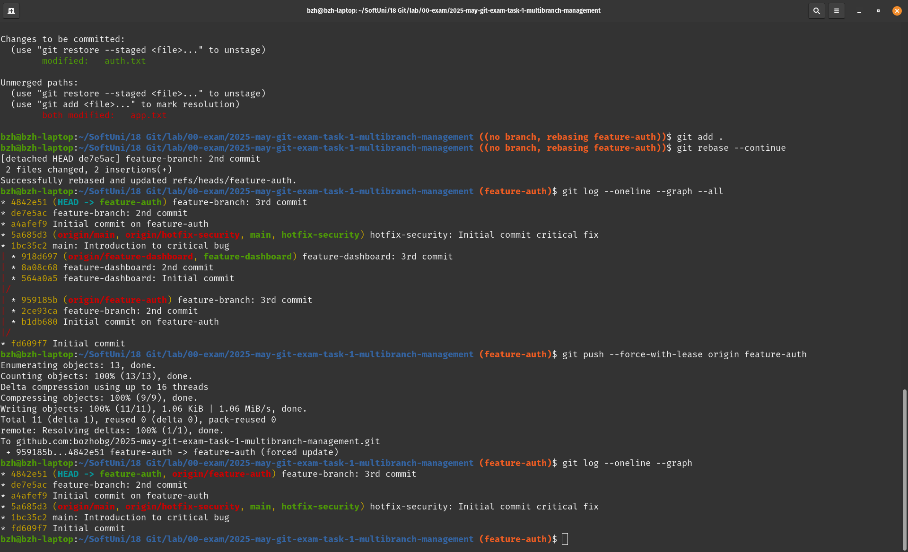
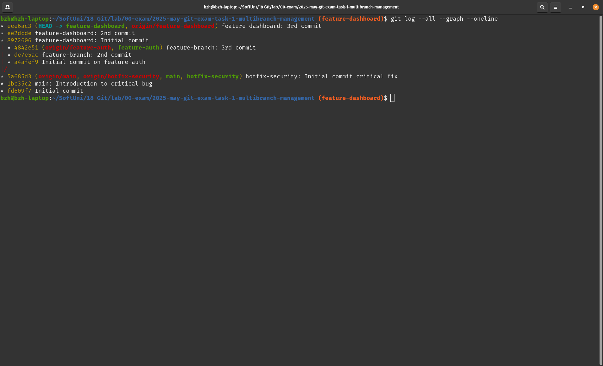
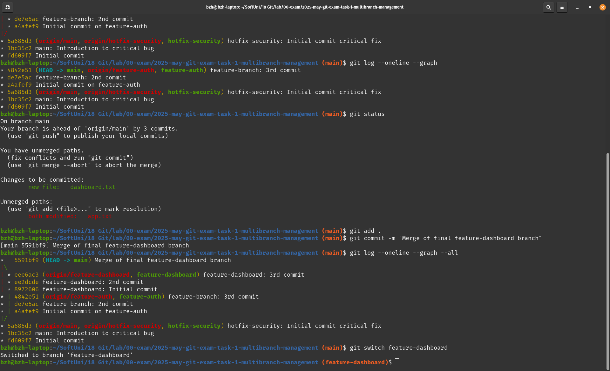
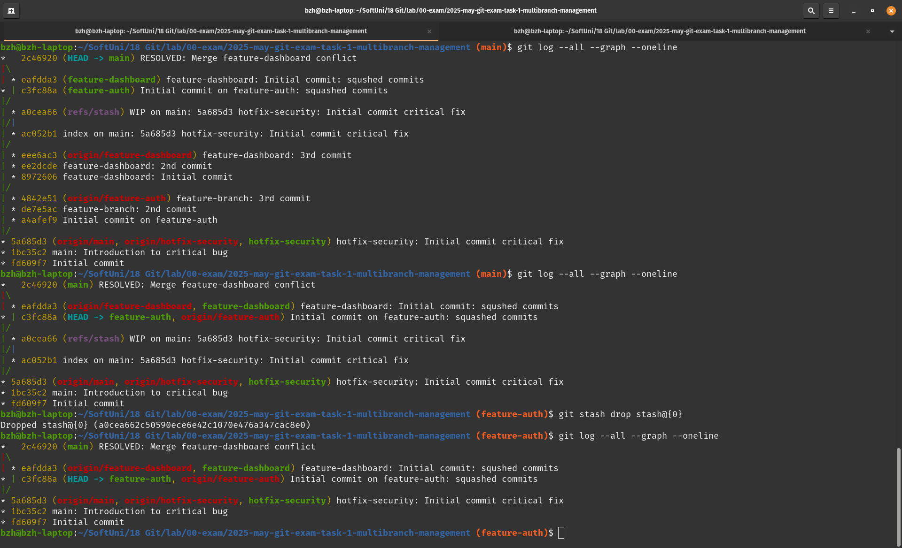
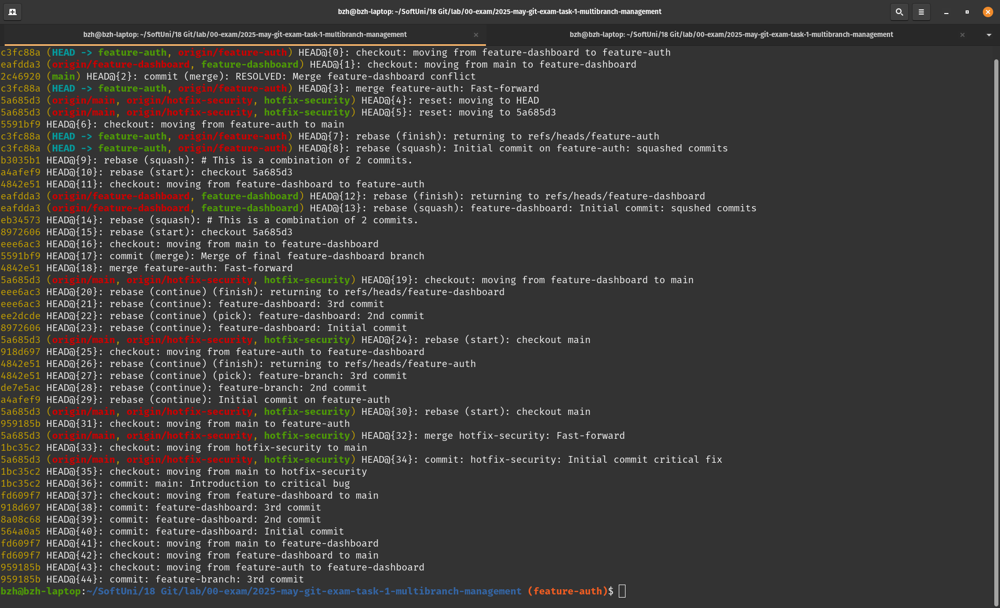

## Multi-Branch Feature Development and Hotfix Management

1. Feature branches and hotfix branch git log, before merging (changes made in new and common files):
2. Hotfix merge

3. Rebasing feature-auth (conflict resolutions on app.txt) with push to remote (although rewriting remote history):

4. Rebasing feature-dashboard (conflict resolutions on app.txt - reordering commit lines) with push to remote (although rewriting remote history):

5. Merging feature branches into main
   1. FF first branch merge
   2. conflict second branch merge on common app.txt changes

6. Squashing feature branches
7. Resetting main before previous merge and to merge squashed feature branches with remote pushes

8. git reflog
